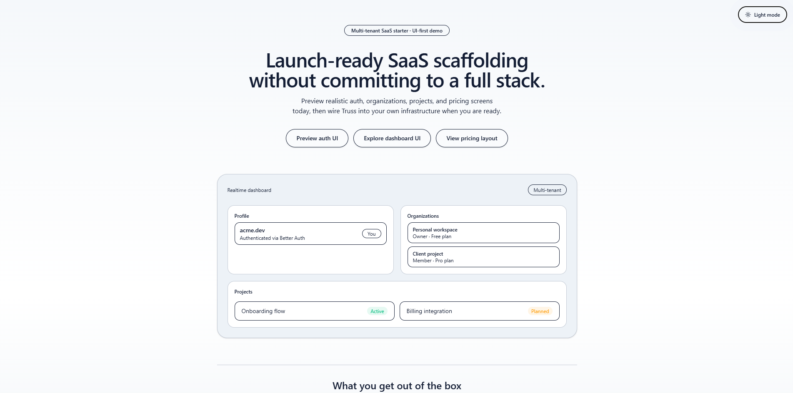
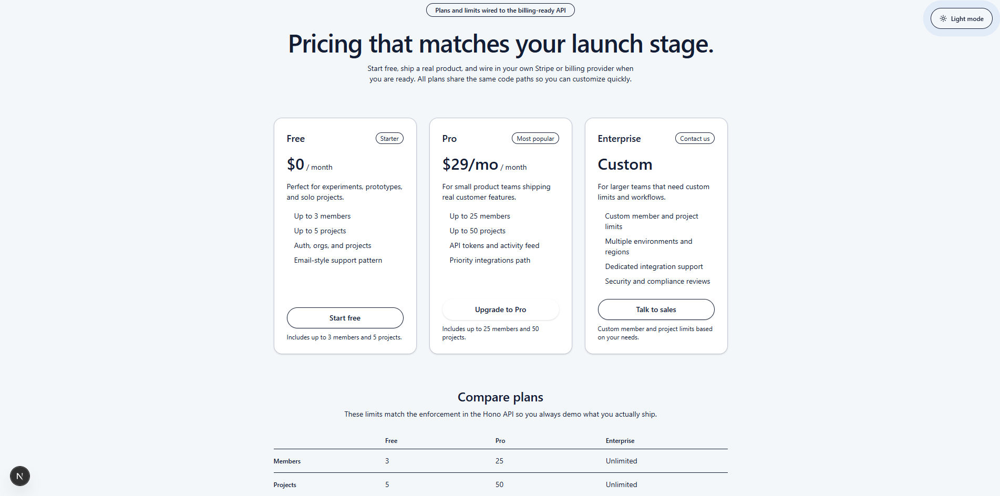
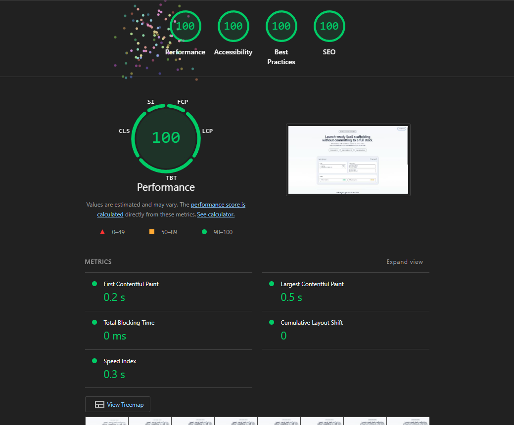

# Truss

Truss is a lightweight, multi-tenant SaaS starter that gives you a clean, opinionated foundation instead of a bloated template.

It is built with:

- Next.js App Router (apps/saas-web)
- Hono API (apps/api)
- Better Auth
- Drizzle ORM (Postgres)
- Tailwind CSS v4
- Truss UI – small Tailwind-based components (buttons, inputs, cards, badges)
- TanStack Query (`@tanstack/react-query`) for interactive dashboard widgets

The goal of Truss is to provide **architecture and scaffolding** you can customize, not a finished product.

For a deeper dive into the stack, architecture, and usage, see:

- [`docs/overview.md`](./docs/overview.md)





## Monorepo layout

- `apps/api` – Hono API server
- `apps/saas-web` – Next.js frontend
- `packages/db` – Drizzle schema and DB helper
- `packages/auth` – Better Auth integration

## Quick start

From the repo root:

```bash
pnpm install
pnpm dev
```

Then open `http://localhost:3000` in your browser.

## Demo mode

The public deployment of Truss is configured as a **UI-only demo**:

- No `DATABASE_URL`, `BETTER_AUTH_SECRET`, or billing keys are set.
- Auth, invitations, and subscription flows are wired in the codebase but disabled in the demo.

You can enable the same banner used in the demo by setting:

- `NEXT_PUBLIC_TRUSS_DEMO_MODE=1` – shows a dismissible notice on the landing page explaining that the instance is running in demo mode. The dismissal is remembered per browser via `localStorage`.

To run the full stack locally, create a `.env` file from `.env.example` and fill in the required values.

## UI primitives and data fetching

Truss ships with a small, Tailwind-based component library used across the auth flows, dashboard, and pricing pages:

- `Button`, `Input`, `Label`, `Card`, `Badge`

These primitives are intentionally minimal so you can replace or extend them with your own design system.

Client-side widgets such as the recent activity feed on `/user` use TanStack Query (`@tanstack/react-query`), wired through a shared `QueryClientProvider` in the Next.js App Router.

## License

MIT — see `LICENSE`.